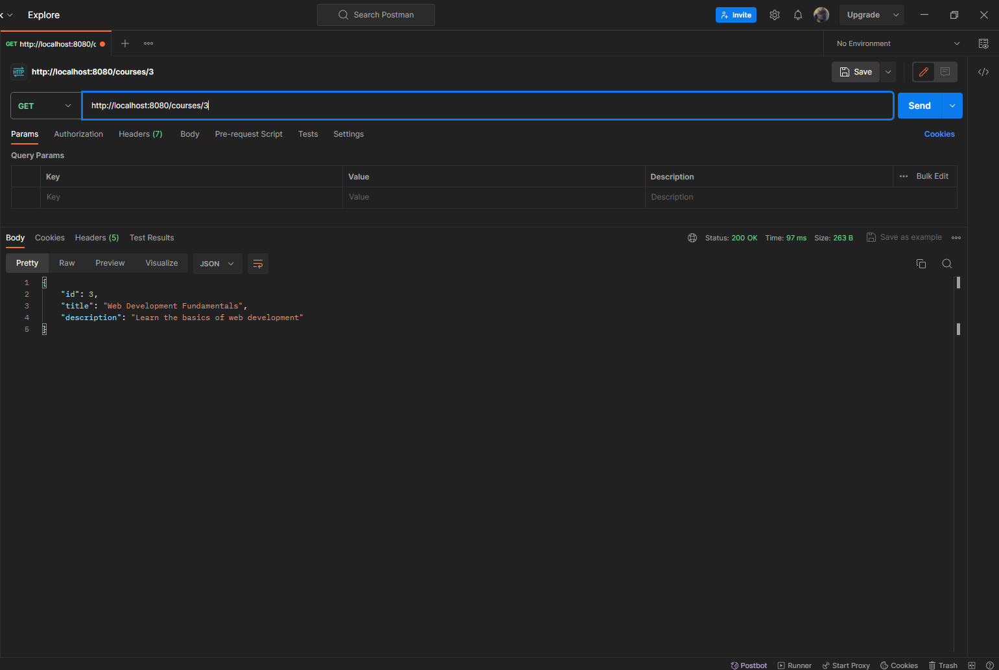
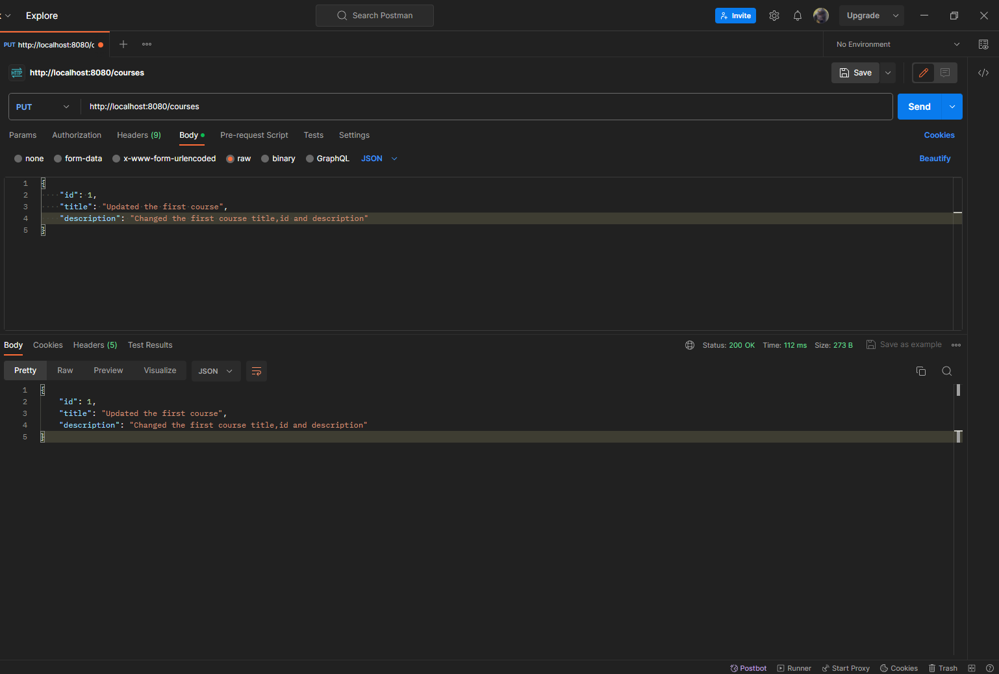

# SpringREST - Spring Boot REST API Project

This is a SpringBoot Rest API project that features CRUD (Create, Read, Update, Delete) operations on courses. The project uses a MySQL database hosted on Aiven.
To reach endpoints all, use an API client like Postman or cURL.

## Database
The project utilizes a MySQL database hosted on Aiven for data storage. Ensure the necessary database configurations are set up in the application properties file.

## Endpoints

- **Home**:
    - URL: `/home`
    - Method: `GET`
    - Description: Returns a welcome message for the SpringBoot Rest API project.
    
<br>

- **Get All Courses**:
    - URL: `/courses`
    - Method: `GET`
    - Description: Fetches a list of all courses.
  
  <br>

- **Get Course by ID**:
    - URL: `/courses/{courseId}`
    - Method: `GET`
    - Description: Fetches details of a specific course identified by `{courseId}`.
  
  <br>

- **Add a New Course**:
    - URL: `/courses`
    - Method: `POST`
    - Description: Adds a new course. Requires a JSON payload with course details.
  
  <br>

- **Update Course**:
    - URL: `/courses`
    - Method: `PUT`
    - Description: Updates an existing course. Requires a JSON payload with the updated course details.
  
  <br>

- **Delete Course by ID**:
    - URL: `/courses/{courseId}`
    - Method: `DELETE`
    - Description: Deletes the course identified by `{courseId}`.
  
  <br>

## Prerequisites

Before you begin, ensure you have the following installed:

- [Java Development Kit (JDK)](https://www.oracle.com/java/technologies/javase-downloads.html)
- Integrated Development Environment (IDE) of your choice

## Setup

1. Clone the repository:

    ```bash
    git clone https://github.com/MeNoobDev/springrest.git
    ```

2. Open the project in your preferred IDE.

3. Configure the MySQL database connection in the `application.properties` file:

    ```properties
    spring.datasource.url=jdbc:mysql://<your-database-host>:<port>/<your-database-name>
    spring.datasource.username=<your-username>
    spring.datasource.password=<your-password>
    ```

## Run the Application

Run the Spring Boot application from your IDE or use the following command:

```bash
./mvnw spring-boot:run
